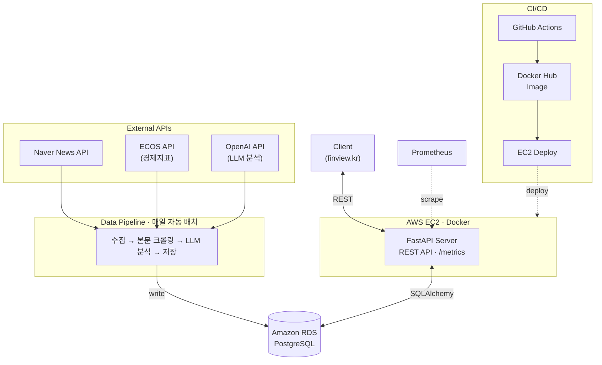

<div align="center">

# FinSight Server

**금융 뉴스를 수집·분석해 제공하는 API 서버**


</div>

---

## Overview

FinSight는 5인 팀 프로젝트의 뉴스 수집·분석 백엔드 서버입니다. 백엔드 서버가 두 개로 나뉘어 있었고, 그중 뉴스 수집·분석 서버를 맡아 설계부터 배포·운영까지 담당했습니다. (다른 백엔드는 퀴즈·로그인 도메인을 담당했습니다.)

단순 CRUD 서버가 아니라, 외부 데이터를 매일 자동으로 수집하고 LLM으로 분석해 저장하는 파이프라인과 그 결과를 내려주는 API, 그리고 이걸 굴리기 위한 인프라(EC2·RDS·CI/CD·모니터링)까지 포함합니다.

- 대회 기간 중 약 한 달간 실서비스로 운영 (`finview.kr` 연동)
- 매일 정해진 시각에 자동 수집·분석 배치 실행
- EC2(앱) / RDS(DB) 분리 배포

## Architecture



## Tech Stack

| 구분 | 기술 |
| --- | --- |
| Language | Python 3.10+ |
| Framework | FastAPI |
| Database | PostgreSQL · SQLAlchemy · Alembic · pg_bigm |
| Infra | AWS EC2, Amazon RDS, Docker, Docker Compose |
| CI/CD | GitHub Actions, Docker Hub |
| Monitoring | Prometheus (`/metrics`) |
| External | Naver News API, ECOS(경제지표), OpenAI API |

## Features

- 매일 정해진 시각에 뉴스 수집 → 본문 크롤링·필터링 → LLM 분석 → 경제지표 연계 저장까지 무인으로 도는 자동화 파이프라인
- 기사 조회/검색 API (최신·카테고리별·키워드 검색, 분석 결과 포함 상세)
- 섹터/주제별 뉴스레터 아웃라인 생성·발행
- 관리자 API (기사 소프트 삭제/복구/영구삭제, `X-ADMIN-KEY` 인증)
- Prometheus 메트릭 노출 및 주기적 시스템 메트릭 로깅

## 설계 의사결정

**EC2와 RDS 분리.** 앱 서버는 언제든 컨테이너를 갈아끼울 수 있어야 한다고 봤습니다. 데이터를 EC2 안에 두면 재배포할 때마다 날아갈 위험이 있어서, 상태는 관리형 RDS에 맡기고 앱은 stateless하게 뒀습니다. 백업과 가용성 관리도 자연스럽게 RDS 쪽으로 넘어갔습니다.

**환경 파일 우선순위.** `ENV_FILE > .env > .env.dev > .env.prod` 순으로 설정을 읽게 해서, 로컬·개발·운영을 코드 수정 없이 전환할 수 있게 했습니다.

**CI/CD.** main에 push하면 GitHub Actions가 이미지를 빌드·푸시하고 EC2에 SSH로 붙어 컨테이너를 교체합니다. 문서 변경(`docs/`, `README.md`)은 `paths-ignore`로 빼서 불필요한 배포를 막았습니다.

**용어 요약 컬럼 (Progressive Disclosure).** 수집한 경제 용어의 정의(`definition`)가 너무 길어서 그대로 노출하면 화면이 부담스러웠습니다. `domain_terms`에 `summary` 컬럼을 추가하고(Alembic 마이그레이션), 요약을 먼저 보여주고 긴 정의는 필요할 때 펼치는 식으로 풀었습니다.

**데이터베이스 인덱싱.** 조회 쿼리의 실행계획을 `EXPLAIN`으로 확인하며 인덱스를 설계했습니다.
- 목록 조회(`/today`, `/category`)는 `status`·`is_deleted` 필터에 `published_at DESC` 정렬이 붙는 패턴이라, `(status, is_deleted, published_at DESC)` 복합 인덱스로 Seq Scan + Sort를 Index Scan으로 전환했습니다(정렬 연산 제거).
- 한국어 부분일치 검색은 처음에 pg_trgm을 적용했으나, 3-gram 특성상 '금융' 같은 2글자 한국어를 색인하지 못해 인덱스가 무효했습니다. CJK용 **pg_bigm(2-gram)** 함수 인덱스로 교체하고 검색을 `lower(col) LIKE`로 변경해 `Bitmap Index Scan`으로 전환했습니다. (벤치마크 상세는 별도 문서)

## 트러블슈팅: 뉴스 수집 신뢰성

처음엔 브라우저에서 멀쩡히 보이던 기사가 `requests`로 받으면 빈 HTML만 오거나 본문이 비어 있었습니다. 원인을 좁히려고 응답 코드와 HTML을 직접 찍어 브라우저 결과와 비교해봤는데, 알고 보니 JS 렌더링 문제가 아니라 요청에 User-Agent가 없어서 봇으로 막힌 것이었습니다. 그래서 헤더에 브라우저 User-Agent를 실어 차단을 우회하고, BeautifulSoup으로 본문 컨테이너 태그만 정확히 집어 추출했습니다.

이렇게 수집한 원문을 DB에 저장하고 LLM으로 넘기려다 두 번째 문제를 만났습니다. 본문에 광고 텍스트와 깨진 문자가 섞여 있었는데, 이대로 LLM에 넣으면 분석 품질이 떨어질 게 뻔했기 때문입니다. 그래서 파싱 전에 `<script>`·`<style>`·광고 요소를 DOM에서 먼저 제거하고, 남은 텍스트는 정규식으로 기자 이메일 같은 패턴까지 후처리로 걸러냈습니다.

그런데 아무리 정제해도 모든 기사가 깨끗하게 나오지는 않았습니다. 그래서 본문 최소 길이 같은 '정상 수집' 기준을 정해두고, 이 기준을 넘기지 못한 기사는 아예 LLM에 보내지 않고 폐기하도록 했습니다. 결국 외부 데이터는 믿을 수 없다는 전제로, 문제 있는 데이터가 하류(LLM·DB)까지 흘러가기 전에 수집 단계에서 걸러내는 쪽을 택한 셈입니다. 이 기준은 대회 기간 한 달 동안 매일 자동 배치에 그대로 적용되며 안정적으로 돌아갔습니다.

## Getting Started

```bash
# 1. 의존성 설치
python -m venv .venv && source .venv/bin/activate   # Windows: .venv\Scripts\activate
pip install -r requirements.txt

# 2. 환경 변수 설정
cp .env.example .env        # DATABASE_URL, OPENAI_API_KEY, NAVER_*, ECOS_API_KEY 등 채우기

# 3. DB 마이그레이션 (한국어 검색 인덱스에 pg_bigm 확장이 필요합니다.
#    로컬은 pg_bigm 설치 필요, AWS RDS는 기본 지원)
alembic upgrade head

# 4. 개발 서버 실행
uvicorn app.main:app --host 0.0.0.0 --port 8000 --reload
```

- API 문서: `http://localhost:8000/docs`
- 헬스체크: `http://localhost:8000/health`
- 메트릭: `http://localhost:8000/metrics`

파이프라인 실행:

```bash
python scripts/news/pipeline.py                            # 뉴스 수집·분석
python scripts/ecos/ingest_ecos_incremental.py --recheck-days 7   # 경제지표 증분 수집
```

## API

| Method | Endpoint | 설명 |
| --- | --- | --- |
| GET | `/health` | 서버·DB 연결 확인 |
| GET | `/api/articles/today` | 최신 처리완료 기사 목록 |
| GET | `/api/articles/category/{category}` | 카테고리별 기사 |
| GET | `/api/articles/search?q=` | 제목/설명/해시태그 검색 |
| GET | `/api/articles/{id}` | 기사 상세(분석 결과 포함) |
| GET | `/api/letters/{sector}/{key}` | 최신 뉴스레터 초안 |
| DELETE | `/api/articles/admin/{id}` | 기사 소프트 삭제 (`X-ADMIN-KEY`) |

전체 스펙은 실행 후 `/docs`(Swagger)에서 확인할 수 있습니다.

## Project Structure

```
fin_sight_server/
├── app/
│   ├── api/            # articles, health, letters 라우터
│   ├── core/           # 설정 로딩, 모니터링 유틸
│   ├── models/         # SQLAlchemy ORM 모델
│   ├── schemas/        # Pydantic 스키마
│   ├── database.py     # DB 엔진/세션
│   └── main.py         # FastAPI 앱 · CORS · /metrics
├── alembic/            # DB 마이그레이션
├── scripts/            # 뉴스/ECOS/레터 파이프라인
├── Dockerfile
├── docker-compose.prod.yml
└── .github/workflows/deploy.yml   # CI/CD
```
